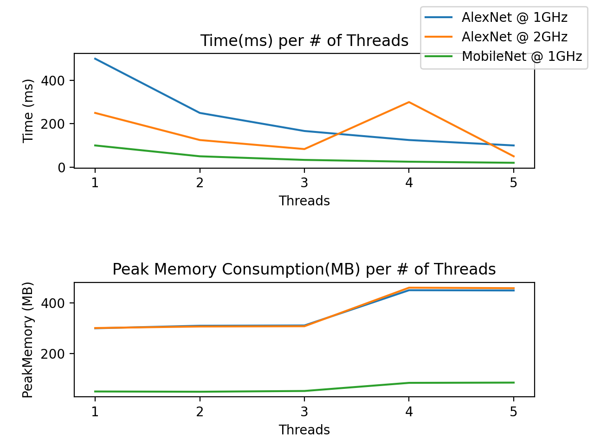

# Technical Assignment - Senior ML System Analysis Engineer (Arm)

__Author:__ Zenios Zeniou (mrzenioszeniou@gmail.com)

The report starts with certain observations that were made
upon first inspection the data. Some of these observations are used as a basis for
the analysis that follows. After that we look at run time and memory consumption as a
function of the software (`Build`). We then analyse performance as a function of the
thread count, before drawing a comparison between devices. The last section is a
summary of the findings and the potential issues that the development team should be
aware of.

## Preliminary Insights

* Each build is run in three variations:
  * `AlexNet` @ 1000MHz
  * `AlexNet` @ 2000MHz
  * `MobileNet` @ 1000MHz

  Plus the thread count variations of build 10.
* Optimisation is only available on `MobileNet` ML network.
* CPU frequency is either 1000 or 2000 MHz.
* Builds 1 to 9 all run on 5 threads.
* Build 10 runs on 1 up to 5 threads.
* Given the limited amount of data for `Device_1` we'll focus on `Device_0` and
  address how their performance differs in a separate section.

## Run Time

Run time seems mostly unaffected by different versions of the software (`Build`) on
`AlexNet`. On `MobileNet` however, we notice a significant drop in run time by a factor
of 3 on builds where optimisations have been enabled. The average run time dropped from
64.6 ms to 21.6 ms as a result of optimising.

Additionally, we see a direct correlation between the increase in CPU frequency and 
decrease in run time. On `AlexNet` the average run time dropped from 101.2 ms to 51.9 
ms when the frequency was doubled from 1000 MHz to 2000 MHz.

## Memory Consumption

Memory consumption holds steady at about 450 MB for all 5-thread tests, with the 
exception of build 10 on `MobileNet` which peaks at 86 MB - a fraction of the other 
5-thread tests.

The consumption drop is not merely due to build 10 being optimised, since we would have
seen a drop in memory consumption with other builds as well. It appears that this
particular software performs exceedingly well on `MobileNet`.

## Thread Count

For this part we are focusing on build 10 which is the only one with variable thread 
count.

Run time seems to respond to the number of threads more or less as expected, with the
exception of `AlexNet` at 2000 MHz where we can see an uptick in execution time for 4
threads.

Memory consumption seems to stay relatively low for up to 3 threads and settle close to
the 450 MB we mentioned earlier for both 4 and 5 threads. Additionally, the
pattern we noticed above -where peak memory is significantly lower on `MobileNet`- 
persists for any number of threads.

## Device 0 vs Device 1

For this part we are focusing on build 10, on `AlexNet` at a CPU frequency of 1000 MHz,
since that's the only data we have for device 1.

Although both devices behave similarly to the change in thread count, device 0 
outperforms device 1 with about half the execution time across all threads. Peak memory
consumption on the other hand, seems to be more or less the same on both devices.

## Summary

Notes for the development team:

- __Device 0__
  - Optimised builds on `MobileNet` seem to be singificantly more performant. If 
    possible, optimised builds on `AlexNet` should also be tested.
  - Increase in CPU frequency yields a proportional decrease in execution time on
    `AlexNet`. If possible, higher frequencies on `MobileNet` should also be tested.
  - Peak memory consumption is __significantly__ reduced with build 10 on `MobileNet`,
    so something goes very well or very wrong there. Is this expected or should it be
    investigated?
  - Peak memory consumption with build 10 doesn't scale very smoothly. It stays on what
    is seemingly the same level for 1,2, or 3 threads and jumps to a
    higher level for both 4 and 5 threads. Is this expected or should it be investigated?
  - Build 10 on `AlexNet` at 2000 MHz with 4 threads yields a suspiciously high 
    execution time. Is this expected or should it be investigated?

- __Device1__
  - Execution time is about half than that of device 0. Is this expected?